# [多摩クマ R.01 / TAMA-KUMA R0.1]

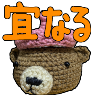

## 説明

|1|2|3|4|
|-|-|-|-|
|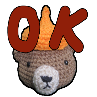||||
|OK|タイ焼き GOOD|クリームソーダ LOVE|クマ NICE|
|||||
|おねがーい|Yeah!|拝承と承知しましたではやる気が伝わらないと思ったら**ラジャー**と言ってめんどくさいなぁと思われる|めがねがないと思って頭にある時の衝撃を思え！|
|||||
|初老だからしょうがないんですよね|（他のスタンプと一緒に使う予定です）|（他のスタンプと一緒に使うかも）|<ruby>奉り候<rp>（</rp><rt>たてまつりそうろう</rt><rp>）</rp></ruby>＝申し上げます的なこと|
|||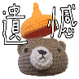||
|演劇やドラマなどの最後の場面ですべてがめでたく収まる結末のこと|Come on!|くそXXX（例えば、IT業界では最低なプログラムのことをかつては「くそコード」と呼んだ）ではコンプライアンス違反になりかねないから、政治家風にイカンを使う|二択で提示されたら即リアリー？と答えたい|
|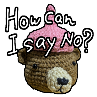||||
|英国ではYesというかわりに使う（かもしれない）|支配的な飲酒文化にただ従うのではなくアルコールとの関係を問い直したりすること|<ruby>仕り候<rp>（</rp><rt>つかまつりそうろう</rt><rp>）</rp></ruby>＝承知いたしました的なこと|もっともであるなあ。その通りであるなあ。`京極夏彦 鵺の碑` P.608|
||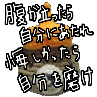|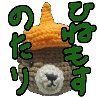|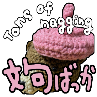|
|アディオス アスタ ルエゴ（Adiós, hasta luego）、`太陽の子エステバン`のエンディングで言っていたよ（たぶん）|`「ひとつ、村上さんでやってみるか」と世間の人々が村上春樹にとりあえずぶっつける490の質問に果たして村上さんはちゃんと答えられるのか?`のP.31|「朝から晩まで」という意味の“ひねもす”、「のどかにゆったり」という意味の“のたり”の複合語。平塚にある薬局の名前|tons of naggingのNAGは文句やブーブーいうこと、英語|
||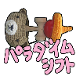||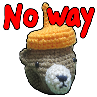|
|気分も自分も転換すればいい|パラダイムシフトは意味自体が変わること、沢山あることが良いこととされる価値観は転換したい|HUNGRY|No Way アントニオ猪木は言わないと信じています|
|||||
|（他のスタンプと一緒に使うかな）|<ruby>逍遥<rp>（</rp><rt>しょうよう</rt><rp>）</rp></ruby>はあちこちをぶらぶら歩くこと。散歩。英語だとramble|妻の新しい呼び方の提案|All right|
|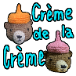||||
|とびきりの最上のもの　`村上春樹 一人称単数`のP.42|絶好調でなくてもいいかなぁ|brilliantは使わないからこれから使えるようになりたい|敬愛するみうらじゅん氏が赤いちゃんちゃんこを着て`おいるショック`とのたまっていました|
|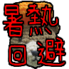||||
|暑熱に順化できるレベルではなくなったから、new normal下で使うことにした|自分の才能・地位などを隠し、くらますこと。また、姿を隠すこと。行くえをくらますこと。|サンキュー|敬愛するみうらじゅん氏がふあんタスティックと述べておられた、**FANTASTIC**|
